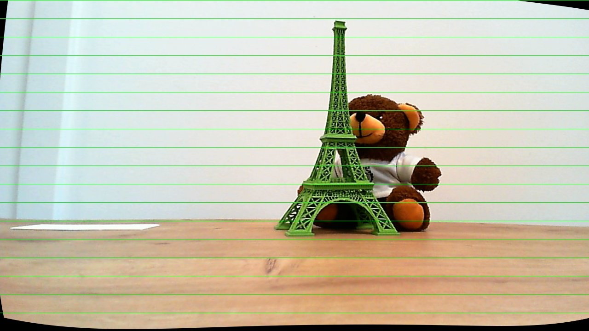
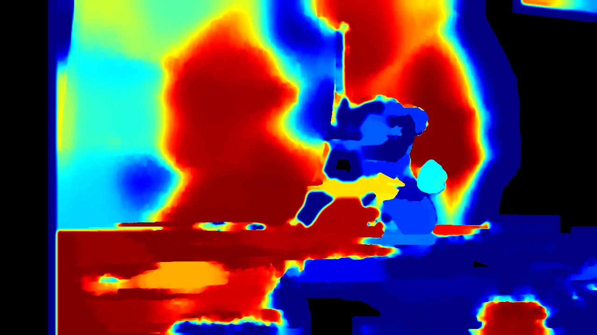
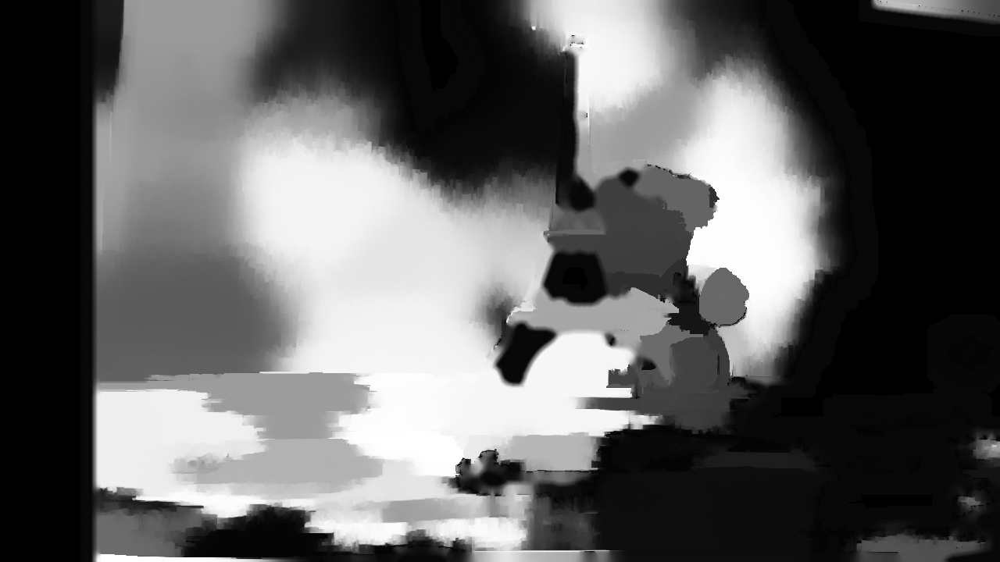
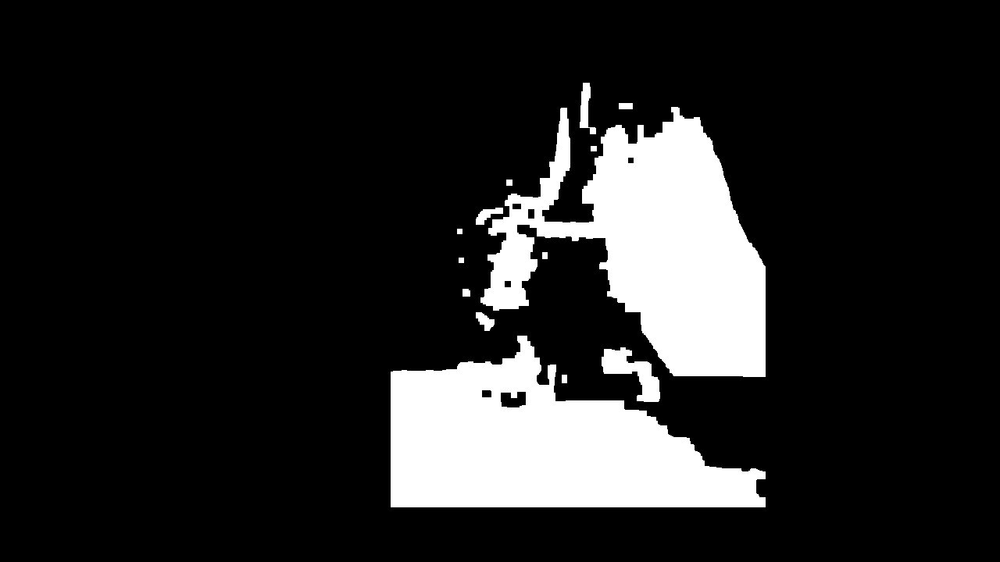
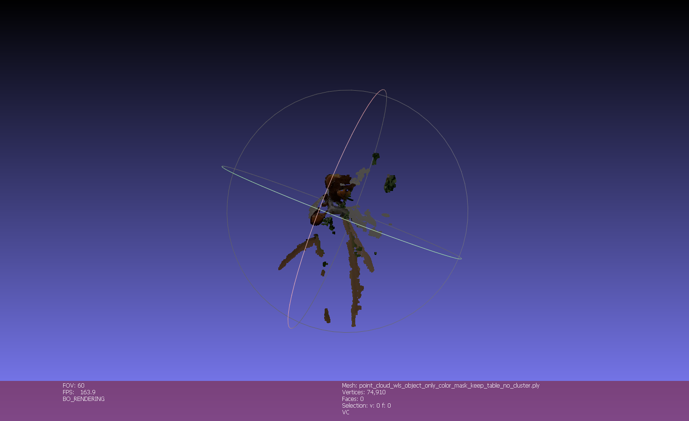

# Stereo Vision 3D Reconstruction

This repository presents a complete **stereo vision pipeline** for 3D reconstruction from image pairs. The project covers the full process from camera calibration to dense reconstruction, using real-world data and classical computer vision techniques.

---

## 1. Overview

The system reconstructs 3D structure from stereo images by combining:

* Camera calibration (intrinsics & extrinsics)
* Epipolar geometry
* Stereo rectification
* Dense disparity estimation
* Depth reconstruction and point cloud generation

The project emphasizes **geometric understanding and experimental validation**, rather than black-box methods.

---

## 2. Pipeline

### Camera Calibration

* Checkerboard-based corner detection
* Intrinsic and distortion estimation
* Stereo calibration (R, T, E, F matrices)

### Rectification

* Alignment of stereo pairs
* Epipolar lines become horizontal
* Enables efficient correspondence search

### Feature Matching

* ORB and SIFT keypoints
* Matching validation using epipolar constraints

### Disparity Estimation

* Dense stereo matching
* Multiple variants explored:

  * Raw
  * WLS filtered
  * Filled
  * Dense filled

### 3D Reconstruction

* Reprojection using matrix **Q**
* Generation of:

  * Point clouds
  * Surface meshes
* Filtering, masking, and clustering applied

---

## 3. Results

### Rectification

Rectified stereo images with aligned epipolar lines:



---

### Disparity Map

Dense filled disparity used for reconstruction:



---

### Processed Disparity

Disparity used for 3D reconstruction after filtering:



---

### Object Mask

Mask applied to isolate the object and reduce noise:



---

### Final 3D Reconstruction

Final selected reconstruction result:



---

## 4. Experimental Results

All reconstruction experiments are stored in:

```text
outputs/3d_reconstruction/
```

This includes:

* Different disparity strategies
* Variations with/without masking
* Filtering and clustering comparisons

Final selected results are grouped in:

```text
outputs/final_best_3d/
```

This separation allows:

* Full transparency of experimentation
* Clear identification of best-performing outputs

---

## 5. Project Structure

```text
configs/
data/
scripts/
src/
outputs/
  3d_reconstruction/
  final_best_3d/
report_assets_final/
reports/
main.py
requirements.txt
```

---

## 6. Usage

Install dependencies:

```bash
pip install -r requirements.txt
```

Run the pipeline:

```bash
python main.py
```

Individual steps can be executed from the `scripts/` directory.

---

## 7. Technical Highlights

* Practical implementation of **epipolar geometry**
* Use of:

  * Fundamental matrix (F)
  * Essential matrix (E)
  * Reprojection matrix (Q)
* Dense stereo matching with post-processing
* Robustness improvements using masking and filtering

---

## 8. Limitations

* Sensitive to calibration accuracy
* Performance depends on scene texture
* Reflective and low-texture areas reduce depth quality

---

## 9. Technologies

* Python
* OpenCV
* NumPy

---

## 10. Author

Petrick and Huseynzada

---

## 11. Notes

This project focuses on **classical geometry-based reconstruction**, demonstrating strong fundamentals in stereo vision and multi-view geometry.

All intermediate results are intentionally preserved to document the full development and evaluation process.
